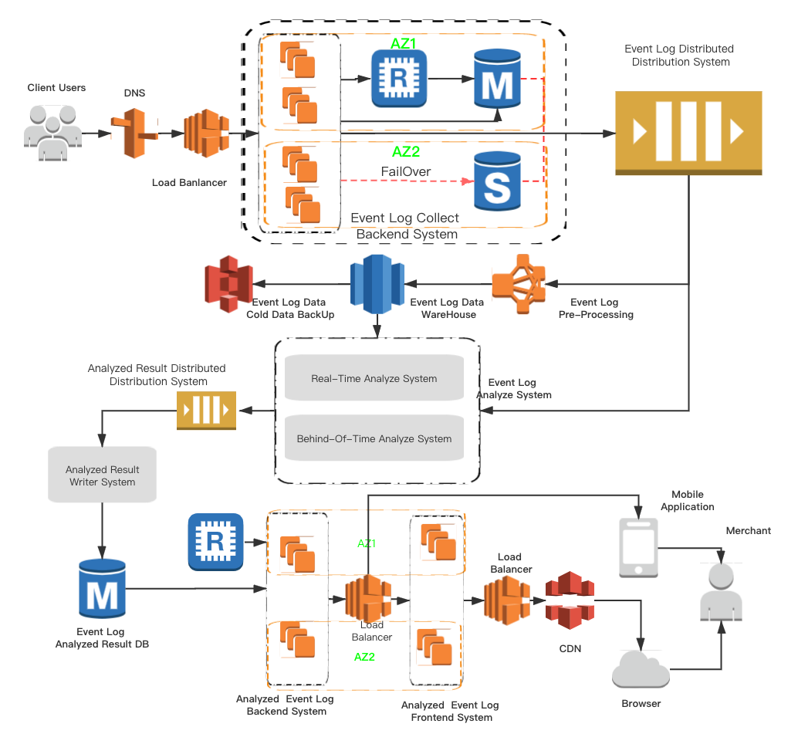

### Load and Capacity Estimation
1. Assume 10 Billion writes per day.About 416 million data per hour, 115K QPS.
2. Assume 10 Million Merchants. only offer analyzed or statistical data to merchants. Because 
Raw data is useless to merchants. So Analyzed Data Result about 10 million/hour. 240 million/day.
3. Assume Merchants doing 12 times query per day if office hour 8 hours. about  1.4K QPS
4. Assume one event log need 1KB, 10billion event raw data need 10TB storage per/day. 
   We also assume analyzed result 1KB szie, 240 million analyzed result need about 230GB storage per/day.


### System Architecture


### Basic System Design

#### 1. DNS && Loader Balancer

We may have multiple Event Log Collector Backend Systems in different region. By using service like 
Amazon Route53 it's possible to return ip address of data center closest to the user's geo location.

#### 2. Event Log Collector Backend System
```Event Log Collector Backend System``` is used to receive events posted by clients. And send the event log
to the MQ for future processing. Backend System may be need to process event log or do authorization using the data from
 merchant's or system configuration databases. Redis or Memcache can be used to cache this data to speed
 the processing.  If there are not complex queries, NoSQL like MongoDB or AWS DynamoDB also works.
 
 In order to improve system availability. The instances are deployed in different available zone, and can 
 auto scale up/down depends on instance cpu or memory loads.
 
 About DB, If we have to choose RDS like MySQL,  Databases was designed in ```active/standby``` mode. 
 when ```active``` database failed down and system can change to standby database quickly.
 
 
 #### 3. Event Log Distributed Distribution System
 ```Event Log Distributed Distribution System``` is used to distribute event logs to downstream service.
 Possible candidates are Apache Kafka, Aws Kinesis, Rabbit MQ among others MQ.
  
 #### 4. Event Log Archiver
 ```Event Log Archiver``` consumer event log from Event Log Distributed Distribution System. And save data to Event Log Data warehouse. 
 Possible candidates are AWS EMR.

#### 5. Event Log Data Warehouse 
```Event Log Data Warehouse``` should be writing efficient. Possible candidates are amazon s3 + redshift, Hadoop.

#### 6. Event Log Cold Data Backup
```Event Log Cold Data Backup ``` is used to back up event log data like 2~3 years ago to reduce cost.
Possible candidates  are AWS S3 Glacier

#### 6. Event Log Analyze Engine
Used to analyze event log. Statistical data hourly, daily, monthly and Annually.

##### 6.1 RealTime Analyze 
```RealTime Analyze System``` consume the stream from MQ and statistical data hourly. after analyzing data and send data 
to Analyzed Result Distributed Distribution System. Possible candidates are Apache Flink, Apache Spark.

##### 6.2 Behind-Of-Time Analyze
```Behind-Of-Time Analyze System``` take data from Event Log Data WareHouse or Event Log analyzed result to statistics daily, 
monthly, annually. and pub analyzed result to Analyzed Result Distributed Distribution System.


#### 7. Analyzed Result Distributed Distribution System
Used as Delay Queue inorder to prevent to a large number thread to write database at the same time. 
Possible candidates Apache Kafka, AWS Kinesis, Rabbit MQ, Rocket MQ.
                                                                                                      among others.
#### 8. Analyzed Result Writer Engine
```Analyzed Result Writer Engine``` is used to write analyzed result to db in a certain number of process.
   
#### 9. Analyzed Result Database
```Analyzed Result Database``` is used to save analyzed result for merchants to query. If there is not 
complex relationship between data we can consider distribute database like mongodb, cassandra. Otherwise
we have to choose RDS like MySql and consider database/table partition.

#### 10. Analyzed Result Backend System
```Analyzed Result BackEnd System``` provide api for merchants to search. like ``` Event Log Collector Backend System```
to improve system availability compute instance will be deployed in multi available zones, and can be scaled up/down 
depends system load status . And for security, the api would be exposed by load balancer.  

#### 11. Analyzed Result Frontend System
```Analyzed Result Fontend System``` provide web view for merchants. and communicate with backed system throw 
backend system load balancer. In order to speed up web load speed. we can choose Aws Cloudfront, CloudFlare or other  
managed CDN service.


